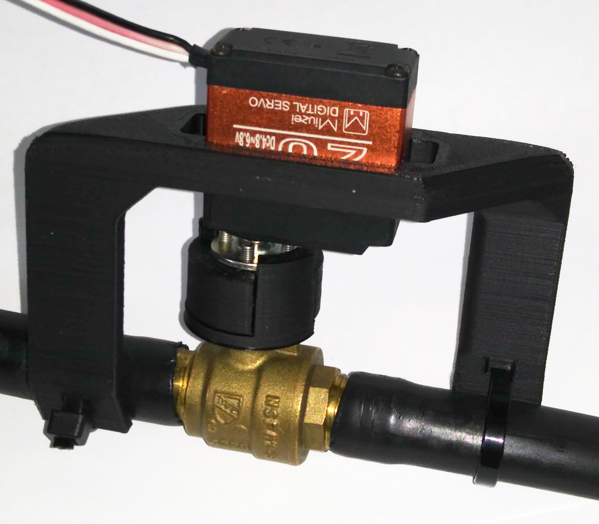
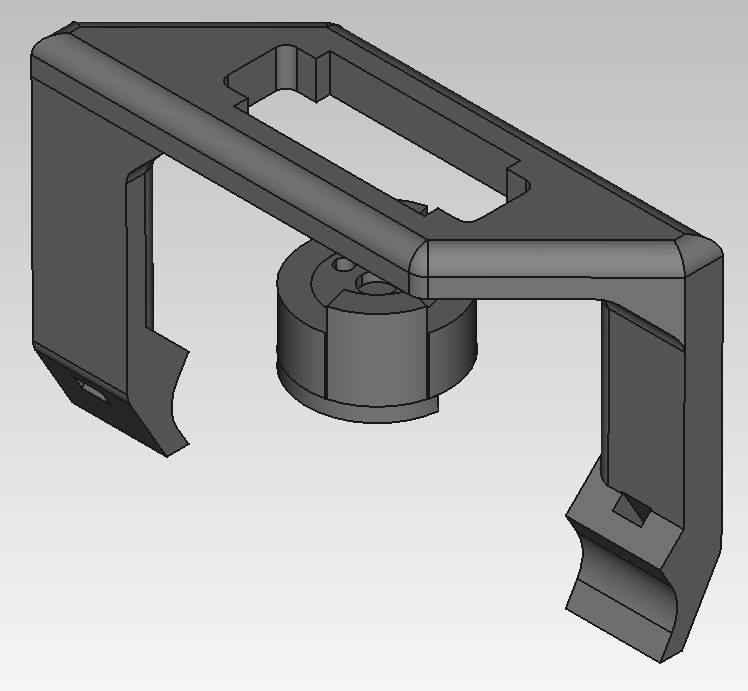
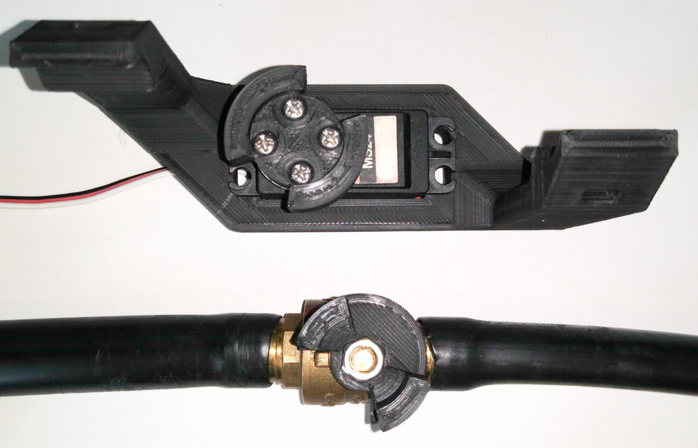

# Servo-Valve
This is a fully parametric 3D printed fixture that allows to open and close a ball valve with a servo motor. Designed with FreeCAD to be sturdy and easy to assemble.

## Hardware
- A standard-sized, high-torque, metal-geared servo motor. Higher torque is better to counteract initial friction in the ball valve. Up to 40 kg-cm servos  are readily available in the standard size. 30+ kg-cm is definitely recommended;
- A circular, metal horn for the servo, with at least two attachment screws;
- A regular ball valve, that opens counter-clockwise and has a thin stop-notch;
- Two tie-wraps to tie around the pipe;
- Two to four screws to secure the servo against the plastic bracket.

## Recommendations
- The part that is screwed onto the valve should be printed at 100% plastic fill to prevent stripping of the square hole;
- Other parts can be printed with 30% fill. Mileage may vary;
- The servo mounting holes are typically 4.5 mm in diameter, which fits M4 or #8 screws well;
- It is recommended to have a way to power off the servo a few seconds after activation, to prevent overheating;
- Alternatively, use the play between the two rotating parts to move the servo backwards a bit after you open/close the valve. The "gears" are then loose and the servo is not applying any force on the valve.
  - For example: 
    - Open: 2100 µs -> Wait 2 seconds -> 2050 µs
    - Close: 700 µs -> Wait 2 seconds -> 750 µs
  
